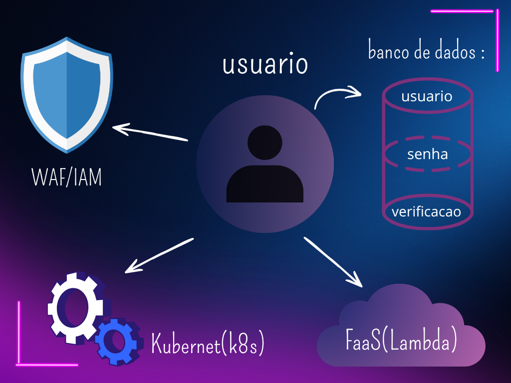

# cloud-telemetry-architecture
Arquitetura de nuvem resiliente para telemetria em tempo real, focada em Cybersecurity e baixa latência ( #cloud-computing  #cybersecurity  #architecture  #kubernetes  #serverless  #dubai)

# 🏁 Cloud Infrastructure: Telemetria de Alta Performance (Dubai)

Este projeto documenta a arquitetura de uma solução em nuvem focada em **segurança**, **baixa latência** e **escalabilidade**, desenhada para um sistema de telemetria em tempo real.

## 📐 O Desafio
Criar uma estrutura capaz de processar dados de telemetria com o mínimo de atraso para usuários em Dubai, garantindo que falhas no servidor sejam corrigidas automaticamente e que o custo seja otimizado.

## 🛠️ Soluções Implementadas
* **Performance:** Uso de **POPs** para reduzir a latência e criptografia **ChaCha20-Poly1305**.
* **Segurança de Elite:** Implementação de **IAM (Identity and Access Management)** seguindo o Princípio do Menor Privilégio e conceitos de **Zero Trust**.
* **Arquitetura Resiliente:** Orquestração de containers com **Kubernetes (K8s)** para "autocura" e **FaaS (Serverless)** para eventos críticos como detecção de quedas.
* **Conformidade:** Estrutura alinhada com **LGPD** e **ISO 27001**.

## 📊 Arquitetura Visual

---
*Projeto desenvolvido como parte dos estudos de Cloud Computing e Cybersecurity.*
